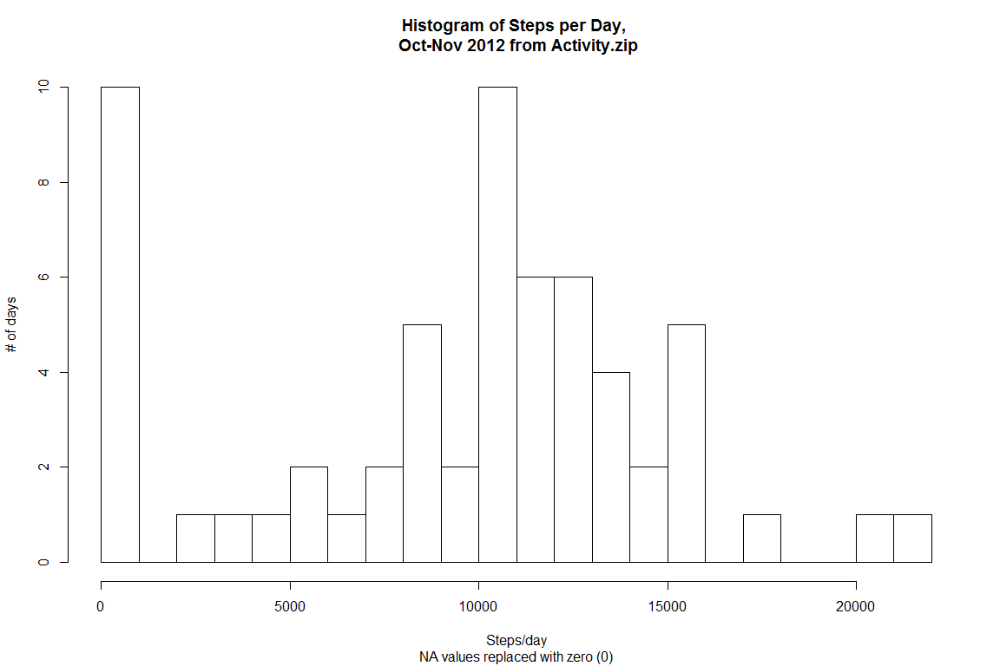
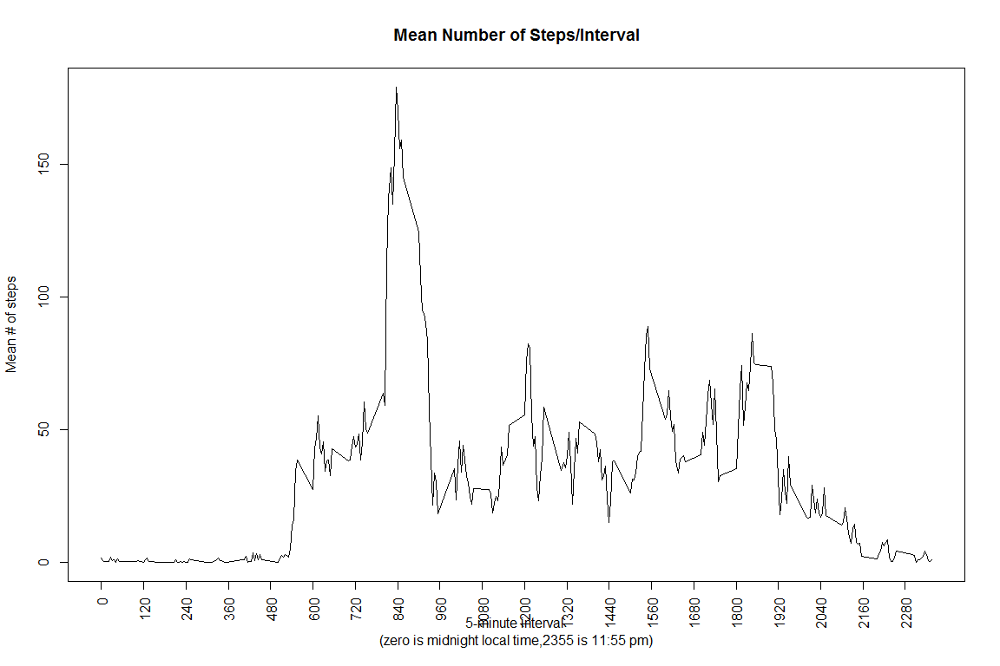
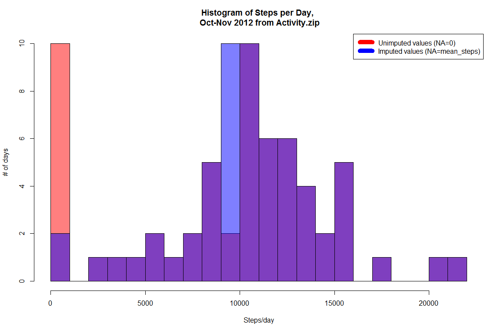
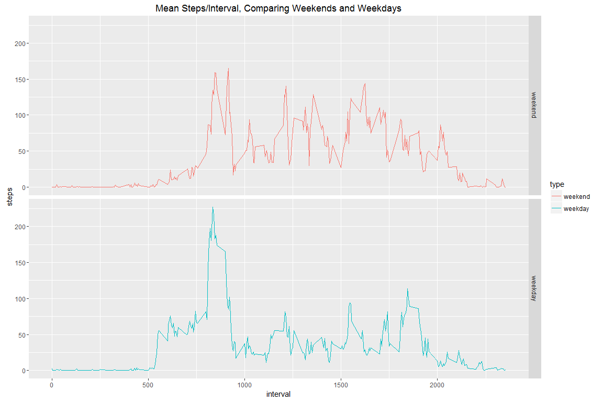

# Reproducible Research: Peer Assessment 1
Author: mkepke@earthlink.net
Date: May 20, 2016

This is my submission for Reproducible Research Class Project 1 (CP1).  CP1 is a multi-part project that ultimately delivers a single markdown document that performs data analysis operations on a course-supplied dataset.  The dataset consists of two months of data (from Oct and Nov 2012) recording number of steps taken by individuals in 5 minute intervals.  The recording was performed by personal activity recording devices such as Fitbit, Jawbone Up et al.

The major tasks required to be addressed in the CP1 markdown document include:

- Code for reading in the dataset and/or processing the data
- Creation of a histogram of the total number of steps taken each day
- Calculation of the mean and median number of steps taken each day
- Creation of a time series plot of the average number of steps taken
- Calculation of the 5-minute interval that, on average, contains the maximum number of steps
- Code to describe and show a strategy for imputing missing data
- Creation of a histogram of the total number of steps taken each day after missing values are imputed
- Creation of a panel plot comparing the average number of steps taken per 5-minute interval across weekdays and weekends

The following sections conform to the class-provided .md template.

## Loading and preprocessing the data
The CP1 assignment provides the dataset [here][1].  This dataset was retrieved and used locally at 5/19/2016.

[1]: https://github.com/rdpeng/RepData_PeerAssessment1/blob/master/activity.zip

First, I will set some environmental variables and then load the data.  I assume the dataset Activity.zip is available in the working directory.

I will demonstrate the activity.zip data has been loaded properly by printing the first few lines using the str() function.


```r
knitr::opts_chunk$set(fig.width=12, fig.height=8, fig.path='Figs/',
                      echo=TRUE, warning=FALSE, message=FALSE)
```

```r
packages=c("plyr","dplyr","sqldf","lubridate","ggplot2")
sapply(packages, require, character.only=TRUE, quietly=TRUE)
```

```
##      plyr     dplyr     sqldf lubridate   ggplot2 
##      TRUE      TRUE      TRUE      TRUE      TRUE
```

```r
setwd("C:/Users/Mark/Desktop/datascience/Reproducible Research/Week 2/RepData_PeerAssessment1")

temp<-"activity.zip"
ActivityDF <- read.csv(unz(temp, "activity.csv"),na.strings="NA",stringsAsFactors = FALSE,header=TRUE)
ActivityDF$date<-as.Date(ActivityDF$date)
str(ActivityDF)
```

```
## 'data.frame':	17568 obs. of  3 variables:
##  $ steps   : int  NA NA NA NA NA NA NA NA NA NA ...
##  $ date    : Date, format: "2012-10-01" "2012-10-01" ...
##  $ interval: int  0 5 10 15 20 25 30 35 40 45 ...
```

## What is mean total number of steps taken per day?
In this section, we are required to report three sub-tasks:

1. Calculate the total number of steps taken per day
2. Make a histogram of the total number of steps taken each day
3. Calculate and report the mean and median of the total number of steps taken per day

Note: we are told that we can ignore missing values - which is understood to mean that:

i) if an entire day's data is missing, we will report the day as zero (0), 
ii) if a partial day's data is missing, we will simply exclude the missing steps-day tuples from the calculations.

First, I calculate the total number of steps taken during each day in the dataset.   To conserve space, only the first rows are shown using the head() function. Reminder: "NA" values have been assigned a zero (0) value. 

```r
ActivityDFNA <- ActivityDF
ActivityDFNA[is.na(ActivityDFNA)] <- 0
DailySteps <- aggregate(.~date,data=ActivityDFNA,FUN=sum)
DailySteps$interval <- NULL
head(DailySteps)
```

```
##         date steps
## 1 2012-10-01     0
## 2 2012-10-02   126
## 3 2012-10-03 11352
## 4 2012-10-04 12116
## 5 2012-10-05 13294
## 6 2012-10-06 15420
```
Now I generate a histogram (remember that days with NA data are reported as zero steps/day)

```r
plot1<-hist(DailySteps$steps,breaks=30, 
     main="Histogram of Steps per Day, \n Oct-Nov 2012 from Activity.zip",
     sub="NA values replaced with zero (0)",
     xlab="Steps/day",ylab="# of days")
```

<!-- -->
Now I calculate and report the mean and median of the total number of steps taken per day (excluding NA data)


```r
MeanMedian<-summary(aggregate(.~date,data=ActivityDF,FUN=sum)) ##Summary fn excludes NA values from mean and median
print(MeanMedian[c(3,4),2])
```

```
##                                     
## "Median :10765  " "Mean   :10766  "
```
## What is the average daily activity pattern?
In this section, we are required to report two subtasks:

1. Make a time series plot (i.e. type = "l") of the 5-minute interval (x-axis) and the average number of steps taken, averaged across all days (y-axis)
2. Which 5-minute interval, on average across all the days in the dataset, contains the maximum number of steps?

I will generate a time-series plot of the average # of steps taken in a given 5-minute interval, where the average (mean) is calculated across all days with data in that interval.  Intervals range from interval=0 - 2355 (i.e. 288 intervals total)


```r
IntervalSteps<-aggregate(.~interval,data=ActivityDFNA,FUN=mean)
IntervalSteps$date<-NULL
colnames(IntervalSteps)<-c("interval","mean_steps")
plot(IntervalSteps$interval, IntervalSteps$mean_steps,type="l",
     xlab="5-minute interval \n(zero is midnight local time,2355 is 11:55 pm)",ylab="Mean # of steps",xaxt="n",main="Mean Number of Steps/Interval")
axis(1, at = seq(0, 2355, by = 120), las=2) ##use 2 hour separation between ticks
```

<!-- -->
Now, I calculate which of the 288 different 5 minute interval contains the highest value of mean # of steps:

```r
MaxIndex<-(which.max(IntervalSteps$mean_steps))
print(IntervalSteps[MaxIndex,])
```

```
##     interval mean_steps
## 104      835   179.1311
```
## Imputing missing values
In this section, we are required to deal with missing ("NA") data via the following subtasks:

1. Calculate and report the total number of missing values in the dataset (i.e. the total number of rows with NAs)

2. Devise a strategy for filling in all of the missing values in the dataset. The strategy does not need to be sophisticated. For example, you could use the mean/median for that day, or the mean for that 5-minute interval, etc.

3. Create a new dataset that is equal to the original dataset but with the missing data filled in.

4. Make a histogram of the total number of steps taken each day and Calculate and report the mean and median total number of steps taken per day. Do these values differ from the estimates from the first part of the assignment? What is the impact of imputing missing data on the estimates of the total daily number of steps?

First I will calculate the total number of rows with missing data/NAs.  The total number of rows with NA/missing values is calculated below, followed by the % of total rows that have NA/missing values:

```r
message("Number of empty rows")
Empty<-(sum(is.na(ActivityDF$steps)))
print(Empty)
```

```
## [1] 2304
```

```r
message ("% of total rows")
print((Empty/nrow(ActivityDF))*100)
```

```
## [1] 13.11475
```
As a strategy for imputing the missing steps-values, I will use the mean 5-minute interval value.  This seems reasonable since we see from the raw data that the number of steps/interval can vary wildly from interval 'n' to interval 'n+1' - using the mean therefore preserves some of this genuine variation.

I will create a new dataframe containing the complete dataset, including the imputed values.  A sample of the required dataset is given with the head() function:

```r
ActivityDFMerge<-merge(ActivityDF, IntervalSteps, by="interval")
##print(head(ActivityDFMerge))
ActivityDFImputed<-ActivityDFMerge
## use a for-if loop to search for rows where steps=NA and replace NA with mean-step value
for (i in 1:nrow(ActivityDFMerge)){
        if(is.na(ActivityDFImputed[i,2])){
        ActivityDFImputed[i,2]<-ActivityDFImputed[i,4]
        }
}
ActivityDFImputed$mean_steps<-NULL
print(head(ActivityDFImputed))
```

```
##   interval    steps       date
## 1        0 1.491803 2012-10-01
## 2        0 0.000000 2012-11-23
## 3        0 0.000000 2012-10-28
## 4        0 0.000000 2012-11-06
## 5        0 0.000000 2012-11-24
## 6        0 0.000000 2012-11-15
```

Then I create a histogram using the dataset including imputed values:

```r
DailyStepsImputed<-aggregate(.~date,data=ActivityDFImputed,FUN=sum)
hist(DailySteps$steps,breaks=30, col=rgb(1,0,0,0.5),
     main="Histogram of Steps per Day, \n Oct-Nov 2012 from Activity.zip",
     xlab="Steps/day",ylab="# of days")
hist(DailyStepsImputed$steps,col=rgb(0,0,1,0.5), breaks=30, add=T)
legend("topright", c("Unimputed values (NA=0)", "Imputed values (NA=mean_steps)"), col=c("red", "blue"), lwd=10)
```

<!-- -->
As we can see from the above overlay histograms, the use of imputed values for missing (NA) values significantly changes the 9000-10000 steps/day bin.

## Are there differences in activity patterns between weekdays and weekends?
In this section, we are required to determine if there are different activity patterns between weekdays and weekends, via two sepecific sub-tasks:

1. Create a new factor variable in the dataset with two levels - "weekday" and "weekend" indicating whether a given date is a weekday or weekend day.

2. Make a panel plot containing a time series plot (i.e. type = "l") of the 5-minute interval (x-axis) and the average number of steps taken, averaged across all weekday days or weekend days (y-axis).

First, I created an expanded version of the Activity dataset with imputed values and identify each day of the study period as weekday or weekend.  The expanded dataset is shown with the head() function:

```r
ActivityDFW<-ActivityDFImputed
ActivityDFW$day<-weekdays(ActivityDFW$date)
#create a vector of weekdays
weekdays1 <- c('Monday', 'Tuesday', 'Wednesday', 'Thursday', 'Friday')
ActivityDFW$type <- factor((weekdays(ActivityDFW$date) %in% weekdays1), 
         levels=c(FALSE, TRUE), labels=c('weekend', 'weekday'))
print(head(ActivityDFW))
```

```
##   interval    steps       date      day    type
## 1        0 1.491803 2012-10-01   Monday weekday
## 2        0 0.000000 2012-11-23   Friday weekday
## 3        0 0.000000 2012-10-28   Sunday weekend
## 4        0 0.000000 2012-11-06  Tuesday weekday
## 5        0 0.000000 2012-11-24 Saturday weekend
## 6        0 0.000000 2012-11-15 Thursday weekday
```
Next I make a panel plot of a time series comparing weekend activity to weekday activity, by first calculating the average 5 min intervals for each of weekdays and weekends, i.e. each has 288 datapoints, then plotting:

```r
## first aggregate the data by the combination of interval + weekend|weekday
IntervalStepsW <- aggregate(steps ~ type + interval, data = ActivityDFW, FUN=mean)
## now plot the resulting data
qplot(x=interval,y=steps,facets =type~.,color=type,data=IntervalStepsW,
      geom="line",main="Mean Steps/Interval, Comparing Weekends and Weekdays")
```

<!-- -->
Looking at the time-series plots, we can see that the average activity level (steps) differs considerably between the weekends and the weekdays: maximum average steps is much higher during the weekday, however it appears the median number of steps is higher during the weekend.

Notably, in either case, activity is near zero until approximately the 500th 5-min interval.

I suggest that the difference in activity levels may be due to the subjects engaging in substantially different activities on weekdays versus weekends.  Further observations would be helpful to explain the differences.
